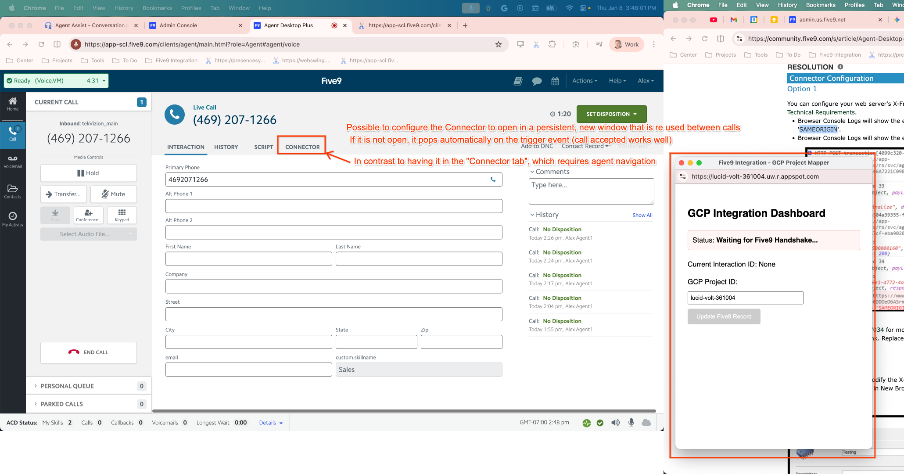

JavaScript CRM SDK: https://app.five9.com/dev/sdk/crm/latest/five9.crm.sdk.js

Deployed at https://lucid-volt-361004.uw.r.appspot.com/

Documentation: https://documentation.five9.com/bundle/crmsdk/page/index.html

Code Samples: https://github.com/Five9DeveloperProgram/Five9CRMSDKSamples

Here is the validation code running in a Five9 Classic Connector. Here you can see that it has loaded the JS and is waiting for the handshake to complete:

